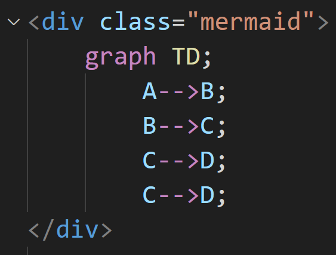
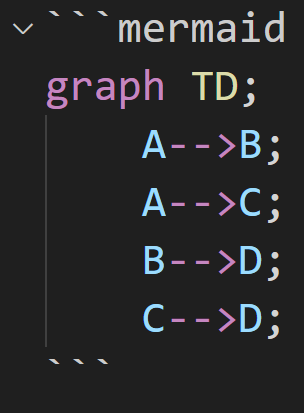

# Mermaid
Mermaid language support and syntax highlight.
Also support embedded mermaid in markdown and html.

## Features
- syntax highlight
- can toggle comment with %%
- support embedded mermaid in markdown and html

## Acknowledgments
Inspiration, code snippets, etc.
- [Mermaid Markdown Syntax Highlighting](https://marketplace.visualstudio.com/items?itemName=bpruitt-goddard.mermaid-markdown-syntax-highlighting)
- [vscode-fenced-code-block-grammar-injection-example](https://github.com/mjbvz/vscode-fenced-code-block-grammar-injection-example)
- [vscode/extensions/html](https://github.com/microsoft/vscode/tree/main/extensions/html)
- [vscode/extensions/markdown-basics](https://github.com/microsoft/vscode/tree/main/extensions/markdown-basics)
